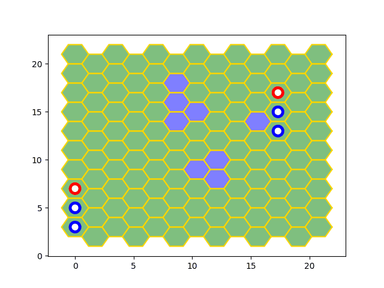

# Hex Game

## What is this about?

This is my pet-project, targeted to improve my RL skills and have fun with development of game inspired by HMM3 fight system and my own game progression.

The main idea is to progressively collect an army of warriors and wim the final boss fight.

When you won for the first time in some location, your warriors get level up and become more smart.

You have to gain more and more experienced army to defeate the fnal boss.

## RL

The main idea here: learn my model